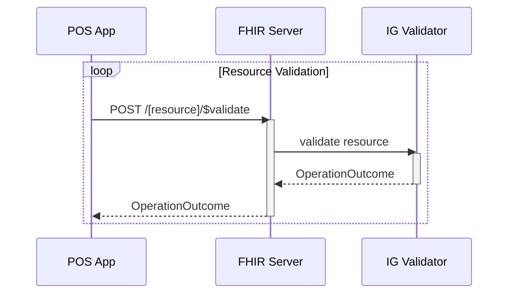
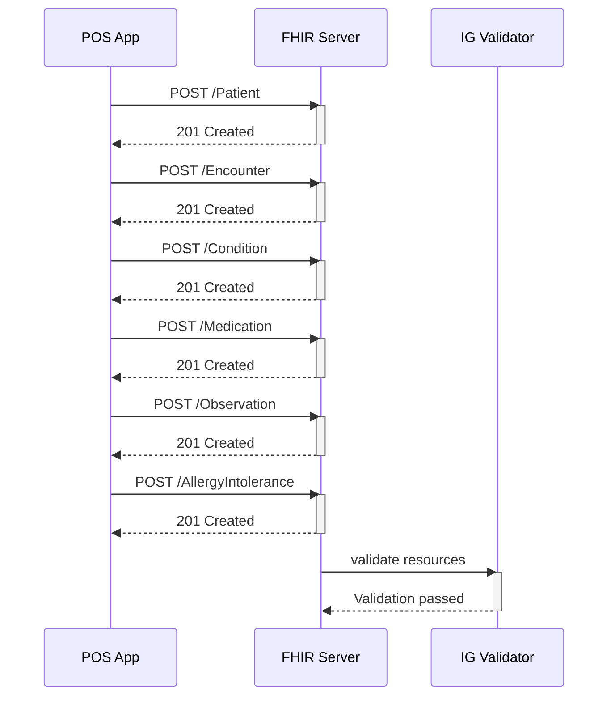
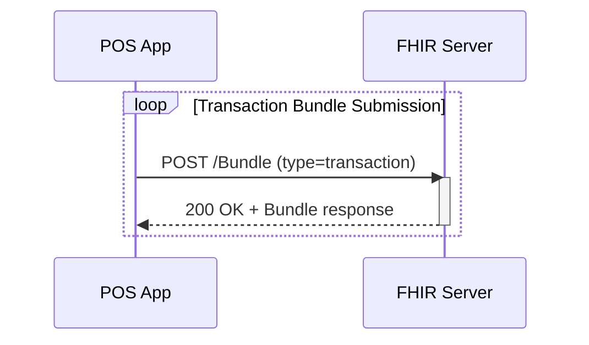

# Track 1:  Point of Service Data Submission to Central Repository

This track will demonstrate how a Point of Service (POS) application can submit health data to a central repository implemented with a HAPI FHIR Server. The track uses the draft NHDR FHIR Implementation Guide (IG) defining the required profiles and value sets for core clinical data exchange (Patient, Encounter, Mediation, Observation etc.).

## Track Goals
* Successfully submit FHIR resources to a central server.
* Successfully submit FHIR bundle to a central server.
* Use $validate operation for IG conformance.
* Provide feedback to refine the IG and profiles.

## Track Leads

| Name  | Organisation    | Email         | Chat        |
|-----------------|-----------------|---------------|-------------|
| TBC      | | | |
| TBC      | | | |

## Servers for Testing

Server | FHIR Version | Base URL | Capabilities
|----------|-------------|---------|-------------|
HAPI Test Server | R4     | https://cdr.fhirlab.net/fhir | CRUD, transaction, validation
Ontoserver terminology Server | R4  | https://tx.fhirlab.net/fhir |   |

## Related Artifacts:
- Draft Implementation Guide: <!-- Insert NHDR FHIR IG link -->
- Postman Collection: <!-- Prepare and upload to GITHUB; Insert link -->
- Sample Data: <!-- Prepare and upload to GITHUB; Insert link -->

## Track Participation
- Point of Service Applications: Create and POST resources using FHIR IG i.e. NHDR IG or CORE IG

## Track Scenarios

### Scenario 1: Validate Resource
1. Submit resource to $validate
2. Server returns OperationOutcome with success or conformance errors

### Scenario 2: Submit Individual Resources
1. Create Patient → Encounter → Condition → Medication → Observation → Allergies
2. Server returns HTTP 201 Created
3. IG validation is passed

### Scenario 3: Submit via Transaction Bundle
1. Send resources in one Bundle (type: transaction)
2. Server processes and returns HTTP 200 with full Bundle response

