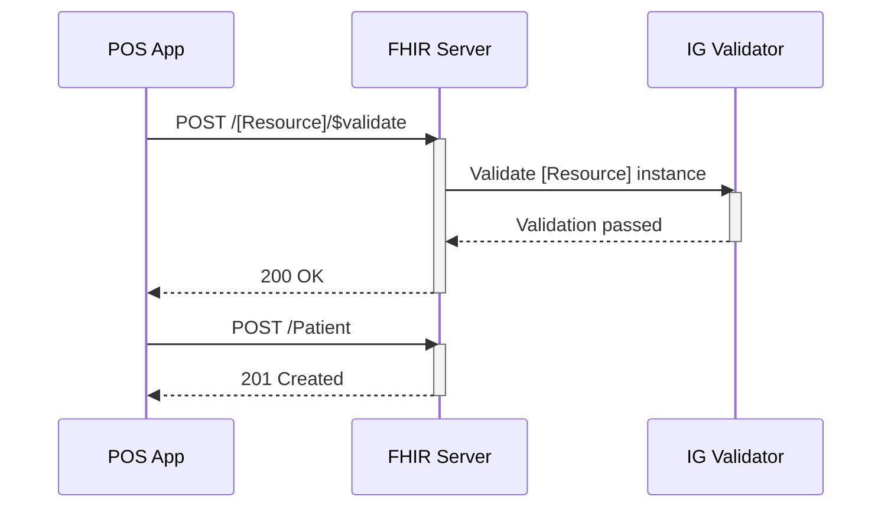
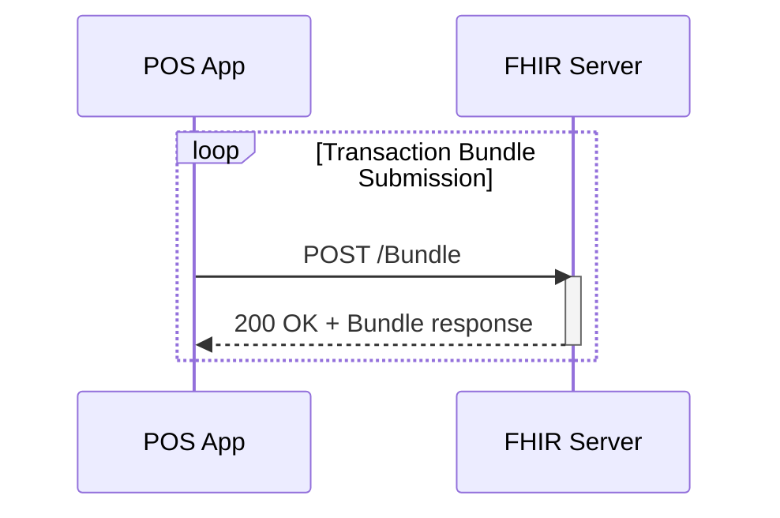

# Track 1:  Point of Service Data Submission

Once a patient walks into a clinic for a routine check-up or to manage a chronic condition, this visit triggers a series of coordinated clinical and administrative actions such as, the patient is identified or registered, a clinician documents observations like blood pressure or temperature, performs procedures such as counselling, prescribes medication, and possibly records immunisation status.

This track simulates that workflow using the [PH Core Implementation Guide](https://build.fhir.org/ig/UP-Manila-SILab/ph-core/), representing foundational resources for data exchange.

> [!CAUTION]
> **The PH Core FHIR IG and NHDR FHIR IG are made available for this track in initial draft forms with limited resources - The IGs are not suitable for production use or advanced testing.**

## Relevance for real-world health-care use-cases: 

- Primary Care Consultation
- NCD Encounter
- Referral Request
- Immunization

## Servers for Testing

Server | FHIR Version | Base URL | Capabilities
|----------|-------------|---------|-------------|
HAPI Test Server | R4     | https://cdr.fhirlab.net/fhir | CRUD, transaction, validation
Ontoserver terminology Server | R4  | https://tx.fhirlab.net/fhir |   |

## Online Tools Provided

The tools below allow you to perform experimentation immediately and interact with others. They are the preferred method of exploring FHIR at the connectathon.

- [Postman Collection with example requests](../sample-data/fhir_resources_collection.json).
- [FHIR validator](https://validator.fhirlab.net)
- [Sample JSON files for PH Core profile](https://build.fhir.org/ig/UP-Manila-SILab/ph-core/artifacts.html#example-example-instances)
- [FHIR endpoint](https://cdr.fhirlab.net/fhir) which also works as OpenAPI/SwaggerUI
- [FHIR server interactive user interface](https://cdr.fhirlab.net/) which also allows creating queries and listing content.

## Offline Tool Options

While the tools above allow great interactive use they are less usable for repeatable processes. Below are some choices you have in case you want to script and repeat some of your experiments:

- [Starting a HAPI server - `FHIR CLI`](https://hapifhir.io/hapi-fhir/docs/tools/hapi_fhir_cli.html#server-run-server): Offers the endpoints above
- [Uploading FHIR IGs - `UploadFIG`](https://github.com/brianpos/UploadFIG#user-content-running-the-utility)
- [Uploading Resources - `Postman local app`](https://www.postman.com/downloads/)
- [Validating Resources - `FHIR validator`](https://confluence.hl7.org/spaces/FHIR/pages/35718580/Using+the+FHIR+Validator)

## Track success 

1. Submit FHIR resource to $validate against FHIR IG
2. Server returns Operation Outcome with success or conformance errors (fix errors and validate again)
3. IG validation is passed
4. Create individual resources such as, Patient → Encounter → Condition → Medication → Observation
5. Server returns HTTP 201 Created
6. Create and Send resources in one Bundle
7. Server processes and returns HTTP 200 with full Bundle response

## Track Scenarios

### Activity 1: Validate and submit individual FHIR resources, using Core FHIR IG (Time: 45 min)

**Rationale:** Testing individual FHIR resources is critical during the early stages of Implementation Guide (IG) development. It allows focused validation of each profile in isolation before evaluating how they interact together.

**Critical Information:** Please document your feedback for individual resource based on the clinical data you’re working with. Consider what’s missing, what doesn’t fit well, and where cardinalities or constraints might not align with real-world use. This is a critical step to strengthen the IG, your feedback will help improve IG and it's implementability. <!-- Include link for google form -->

> [!IMPORTANT]
> After every submission, the server will assign *server-side* identifiers. You will need to use to these identifiers if you are submitting resources that refer to the newly created objects. [Read here why this is the case](FHIR_Resource_References_Explanation.md). Be aware that you are sharing the server with others, so if you are referring to another participants resources, their changes to resources may affect you workflow.

| Step | Activity                                       | Notes                                                                 | Example |
|------|------------------------------------------------|-----------------------------------------------------------------------|---------|
| 1    | Review PH Core IG profiles with examples       | Focus on profiles like PH Core Patient, Encounter, Observation, etc. |         |
| 2    | Setup access to test FHIR server               |                                                                       |         |
| 3    | Create `PH Core Organization` resource         | Can be a clinic, or hospital. You can also use any of the existing organisations                                        |         |
| 4    | `$validate` the Organization                   |                                                                       |         |
| 5    | Submit resource to FHIR server    |                                                                       |         |
| 6    | Create `PH Core Practitioner`                  | Use provided examples, and make changes to your resource. You can also use any of the existing practitioners          |         |
| 7    | `$validate` the Practitioner                   |                                                                       |         |
| 8    | Submit resource to FHIR server    |                                                                       |         |
| 9    | Create `PH Core Patient`                       | Use provided example, customise name, birth date, gender etc.             |         |
| 10   | `$validate` the Patient                        |                                                                       |         |
| 11   | Submit resource to FHIR server    |                                                                       |         |
| 12   | Create `PH Core Encounter`                     | Link Patient, Practitioner, Organization                              |         |
| 13   | `$validate` the Encounter                      |                                                                       |         |
| 14   | Submit resource to FHIR server    |                                                                       |         |
| 15   | Create `PH Core Observation` resources         | E.g., BP, BMI, temperature, etc.                                      |         |
| 16   | `$validate` each Observation                   |                                                                       |         |
| 17   | Submit resource to FHIR server    |                                                                       |         |
| 18   | Create `PH Core Procedure` (optional)          | E.g., health education, counselling                                   |         |
| 19   | `$validate` the Procedure                      |                                                                       |         |
| 20   | Submit resource to FHIR server    |                                                                       |         |
| 21   | Create `PH Core Medication` resource (optional)| Record if medication was prescribed or dispensed                      |         |
| 22   | `$validate` the Medication                     |                                                                       |         |
| 23   | Submit resource to FHIR server    |                                                                       |         |

### Bonus activity: 

Run steps from 1-23 using NHDR IG and document your findings (Time: 20 min)

### Sequence Diagram

---

### Activity 2: Submit a FHIR bundle with multiple PH Core resources in one request.

**Rationale:** In real-world health systems, data about a single patient encounter is rarely created or exchanged as individual, isolated pieces. Instead, multiple interrelated resources are generated together such as the patient record, the encounter, observations, procedures, and provider details. Using a FHIR Bundle simulates how this data would be:

- Generated by an EMR or point-of-care application
- Packaged for transmission
- Submitted to a FHIR server as a single transaction

### Recommended Bundle Composition : Simulate an Encounter in FHIR

| Resource Type    | Purpose                            | Notes                       |
|------------------|------------------------------------|-----------------------------|
| `Patient`        | Subject of the encounter           | Use Core IG profile         |
| `Practitioner`   | Clinician conducting the encounter | Can reuse previous or include new    |
| `Organization`   | Service provider                  | e.g. Clinic or Hospital     |
| `Encounter`      | The actual visit                   | Links all of the resources      |
| `Observation`    | Vitals (BP, weight, BMI)           | At least one                |
| `Procedure`      | Optional (e.g. counselling)        | Optional |

### Bonus Activity: Simulate a Referral in FHIR

Use FHIR R4 ServiceRequest resource to create a Referral Bundle, as an information package to simulate how a basic referral could be shared using FHIR. 
**Note:** the intention of this activity is not to demonstrate an eReferral workflow but enough to demonstrate the core idea of referral data exchange using FHIR.

