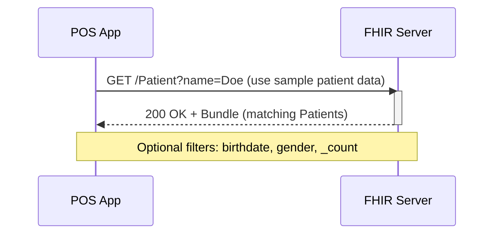
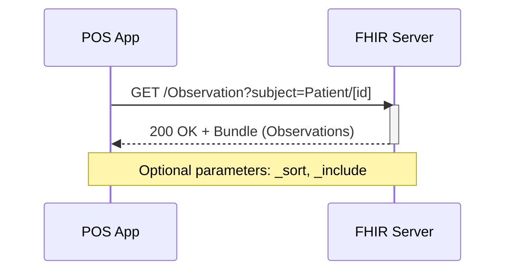

# Track 2:  FHIR Search and Retrieval

This track builds on Track 1 by testing RESTful search and retrieval of clinical data submitted by POS applications. Using the same FHIR server and resource profiles, participants will query the server to retrieve data for specific patients and observations. This supports key workflows like clinical review, analytics, and verification of submitted data.

## Track Goals
* Perform FHIR search queries using standard parameters.
* Retrieve resources such as Patient and Observation using patient ID and filters.
* Verify content accuracy and completeness.
* Reinforce understanding of FHIR REST API conventions.

## Track Leads

| Name  | Organisation    | Email         | Chat        |
|-----------------|-----------------|---------------|-------------|
| TBC      | | | |
| TBC      | | | |

## Servers for Testing

Server | FHIR Version | Base URL | Capabilities
|----------|-------------|---------|-------------|
HAPI Test Server | R4     | https://cdr.fhirlab.net/fhir | CRUD, transaction, validation
Ontoserver terminology Server | R4  | https://tx.fhirlab.net/fhir |   |

## Related Artifacts:
- Draft Implementation Guide: <!-- Insert NHDR FHIR IG link -->
- Postman Collection: <!-- Prepare and upload to GITHUB; Insert link -->
- Sample Data: <!-- Prepare and upload to GITHUB; Insert link -->
- No SMART authorization required

## Track Participation
- Point of Service Applications: Create and POST resources using FHIR IG i.e. NHDR IG or CORE IG

## Track Scenarios

### Scenario 1: Search for Patient by Name

1. Execute GET /Patient?name=_use sample data_
2. 200 OK with Bundle containing matching Patient(s)
3. Use additional filters like _birthdate_, _gender_, or _count_

### Scenario 2: Retrieve Observations / Medications etc. by Patient ID

1. Execute GET /Observation?subject=Patient/[id]
2. 200 OK with matching Observations that reference the Patient.
3. Use _sort or _include options.

